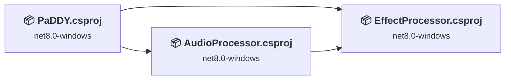
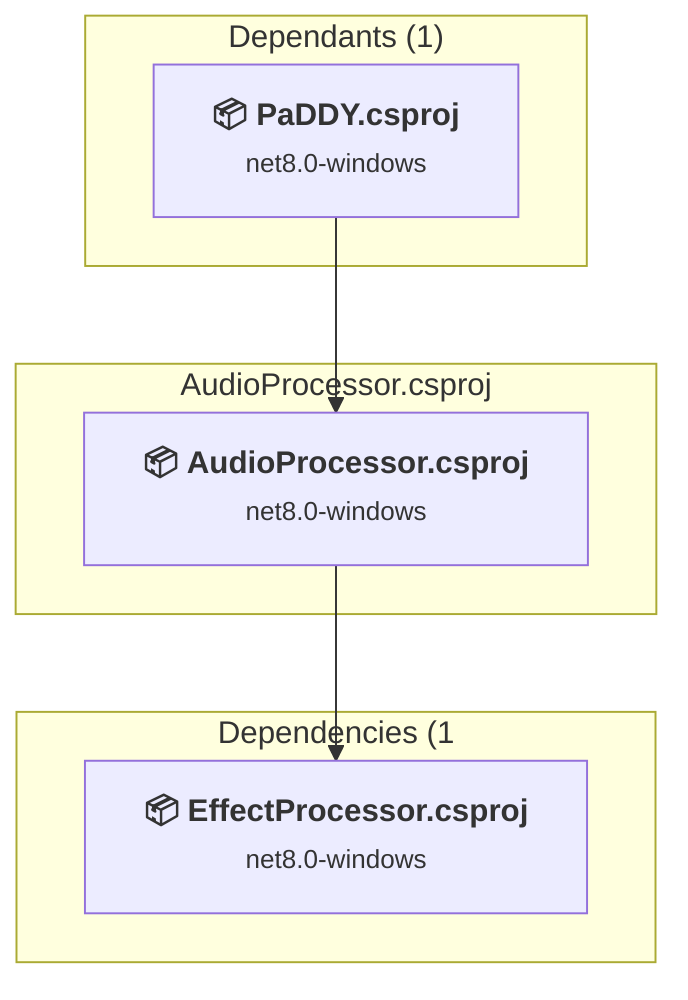
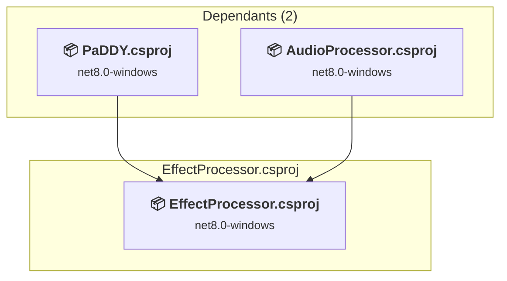
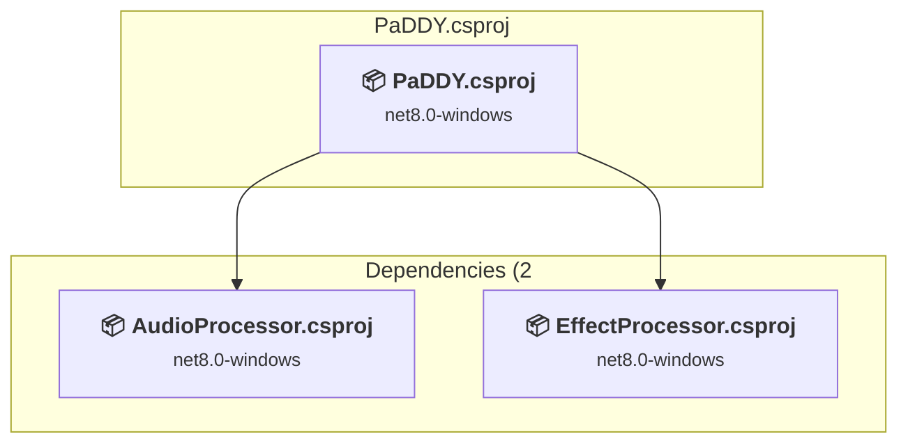

# Projects and dependencies analysis

This document provides a comprehensive overview of the projects and their dependencies in the context of upgrading to .NETCoreApp,Version=v10.0.

## Table of Contents

- [Executive Summary](#executive-Summary)
  - [Highlevel Metrics](#highlevel-metrics)
  - [Projects Compatibility](#projects-compatibility)
  - [Package Compatibility](#package-compatibility)
  - [API Compatibility](#api-compatibility)
  - [Binding Redirect Configuration](#binding-redirect-configuration)
- [Aggregate NuGet packages details](#aggregate-nuget-packages-details)
- [Top API Migration Challenges](#top-api-migration-challenges)
  - [Technologies and Features](#technologies-and-features)
  - [Most Frequent API Issues](#most-frequent-api-issues)
- [Projects Relationship Graph](#projects-relationship-graph)
- [Project Details](#project-details)

  - [AudioProcessor\AudioProcessor.csproj](#audioprocessoraudioprocessorcsproj)
  - [EffectProcessor\EffectProcessor.csproj](#effectprocessoreffectprocessorcsproj)
  - [PaDDY.csproj](#paddycsproj)

## Executive Summary

### Highlevel Metrics

| Metric | Count | Status |
| :--- | :---: | :--- |
| Total Projects | 3 | All require upgrade |
| Total NuGet Packages | 2 | 1 need upgrade |
| Total Code Files | 1520 |  |
| Total Code Files with Incidents | 60 |  |
| Total Lines of Code | 178498 |  |
| Total Number of Issues | 4061 |  |
| Estimated LOC to modify | 4057+ | at least 2.3% of codebase |

### Projects Compatibility

| Project | Target Framework | Difficulty | Package Issues | API Issues | Binding Issues | Est. LOC Impact | Description |
| :--- | :---: | :---: | :---: | :---: | :---: | :---: | :--- |
| [AudioProcessor\AudioProcessor.csproj](#audioprocessoraudioprocessorcsproj) | net8.0-windows | 🟡 Medium | 0 | 533 | 0 | 533+ | ClassLibrary, Sdk Style = True |
| [EffectProcessor\EffectProcessor.csproj](#effectprocessoreffectprocessorcsproj) | net8.0-windows | 🟢 Low | 0 | 0 | 0 |  | ClassLibrary, Sdk Style = True |
| [PaDDY.csproj](#paddycsproj) | net8.0-windows | 🟡 Medium | 1 | 3524 | 0 | 3524+ | Wpf, Sdk Style = True |

### Package Compatibility

| Status | Count | Percentage |
| :--- | :---: | :---: |
| ✅ Compatible | 1 | 50.0% |
| ⚠️ Incompatible | 0 | 0.0% |
| 🔄 Upgrade Recommended | 1 | 50.0% |
| ***Total NuGet Packages*** | ***2*** | ***100%*** |

### API Compatibility

| Category | Count | Impact |
| :--- | :---: | :--- |
| 🔴 Binary Incompatible | 3853 | High - Require code changes |
| 🟡 Source Incompatible | 167 | Medium - Needs re-compilation and potential conflicting API error fixing |
| 🔵 Behavioral change | 37 | Low - Behavioral changes that may require testing at runtime |
| ✅ Compatible | 161640 |  |
| ***Total APIs Analyzed*** | ***165697*** |  |

## Aggregate NuGet packages details

| Package | Current Version | Suggested Version | Projects | Description |
| :--- | :---: | :---: | :--- | :--- |
| MessagePack | 3.1.4 |  | [PaDDY.csproj](#paddycsproj) | ✅Compatible |
| Microsoft.Data.Sqlite | 8.0.15 | 10.0.7 | [PaDDY.csproj](#paddycsproj) | NuGet package upgrade is recommended |

## Top API Migration Challenges

### Technologies and Features

| Technology | Issues | Percentage | Migration Path |
| :--- | :---: | :---: | :--- |
| WPF (Windows Presentation Foundation) | 2338 | 57.6% | WPF APIs for building Windows desktop applications with XAML-based UI that are available in .NET on Windows. WPF provides rich desktop UI capabilities with data binding and styling. Enable Windows Desktop support: Option 1 (Recommended): Target net9.0-windows; Option 2: Add <UseWindowsDesktop>true</UseWindowsDesktop>. |
| Windows Forms | 373 | 9.2% | Windows Forms APIs for building Windows desktop applications with traditional Forms-based UI that are available in .NET on Windows. Enable Windows Desktop support: Option 1 (Recommended): Target net9.0-windows; Option 2: Add <UseWindowsDesktop>true</UseWindowsDesktop>; Option 3 (Legacy): Use Microsoft.NET.Sdk.WindowsDesktop SDK. |
| GDI+ / System.Drawing | 131 | 3.2% | System.Drawing APIs for 2D graphics, imaging, and printing that are available via NuGet package System.Drawing.Common. Note: Not recommended for server scenarios due to Windows dependencies; consider cross-platform alternatives like SkiaSharp or ImageSharp for new code. |
| Legacy Cryptography | 1 | 0.0% | Obsolete or insecure cryptographic algorithms that have been deprecated for security reasons. These algorithms are no longer considered secure by modern standards. Migrate to modern cryptographic APIs using secure algorithms. |

### Most Frequent API Issues

| API | Count | Percentage | Category |
| :--- | :---: | :---: | :--- |
| T:System.Windows.Controls.TextBlock | 260 | 6.4% | Binary Incompatible |
| T:System.Windows.Controls.Slider | 215 | 5.3% | Binary Incompatible |
| T:System.Windows.Visibility | 174 | 4.3% | Binary Incompatible |
| T:System.Windows.RoutedEventHandler | 140 | 3.5% | Binary Incompatible |
| P:System.Windows.Controls.Primitives.RangeBase.Value | 113 | 2.8% | Binary Incompatible |
| T:System.Windows.Controls.ComboBox | 99 | 2.4% | Binary Incompatible |
| P:System.Windows.Controls.TextBlock.Text | 86 | 2.1% | Binary Incompatible |
| T:System.Windows.Media.Color | 86 | 2.1% | Binary Incompatible |
| T:System.Windows.Controls.CheckBox | 70 | 1.7% | Binary Incompatible |
| T:System.Windows.Controls.Button | 63 | 1.6% | Binary Incompatible |
| T:System.Windows.Media.SolidColorBrush | 63 | 1.6% | Binary Incompatible |
| T:System.Windows.Controls.Border | 53 | 1.3% | Binary Incompatible |
| T:System.Windows.Media.Brush | 51 | 1.3% | Binary Incompatible |
| T:System.Windows.Forms.ControlStyles | 48 | 1.2% | Binary Incompatible |
| T:System.Windows.RoutedEventArgs | 47 | 1.2% | Binary Incompatible |
| P:System.Windows.UIElement.Visibility | 44 | 1.1% | Binary Incompatible |
| T:System.Windows.Controls.UIElementCollection | 44 | 1.1% | Binary Incompatible |
| P:System.Windows.Controls.Panel.Children | 44 | 1.1% | Binary Incompatible |
| T:System.Windows.Thickness | 44 | 1.1% | Binary Incompatible |
| E:System.Windows.Controls.Primitives.ButtonBase.Click | 42 | 1.0% | Binary Incompatible |
| P:System.Windows.Controls.Primitives.ToggleButton.IsChecked | 41 | 1.0% | Binary Incompatible |
| F:System.Windows.Visibility.Collapsed | 40 | 1.0% | Binary Incompatible |
| T:System.Windows.Shapes.Rectangle | 40 | 1.0% | Binary Incompatible |
| M:System.Windows.Media.Color.FromRgb(System.Byte,System.Byte,System.Byte) | 38 | 0.9% | Binary Incompatible |
| M:System.Windows.Media.SolidColorBrush.#ctor(System.Windows.Media.Color) | 37 | 0.9% | Binary Incompatible |
| T:System.Windows.Controls.Grid | 35 | 0.9% | Binary Incompatible |
| E:System.Windows.Controls.Primitives.RangeBase.ValueChanged | 34 | 0.8% | Binary Incompatible |
| T:System.Windows.Controls.StackPanel | 32 | 0.8% | Binary Incompatible |
| T:System.Windows.Controls.WrapPanel | 32 | 0.8% | Binary Incompatible |
| P:System.Windows.Controls.Primitives.Selector.SelectedIndex | 30 | 0.7% | Binary Incompatible |
| T:System.Windows.Input.Key | 30 | 0.7% | Binary Incompatible |
| T:System.Windows.Controls.ItemCollection | 29 | 0.7% | Binary Incompatible |
| P:System.Windows.Controls.ItemsControl.Items | 29 | 0.7% | Binary Incompatible |
| T:System.Windows.MessageBoxImage | 28 | 0.7% | Binary Incompatible |
| T:System.Windows.MessageBoxButton | 28 | 0.7% | Binary Incompatible |
| P:System.Windows.FrameworkElement.Width | 28 | 0.7% | Binary Incompatible |
| F:System.Windows.Visibility.Visible | 25 | 0.6% | Binary Incompatible |
| M:System.TimeSpan.FromSeconds(System.Double) | 24 | 0.6% | Source Incompatible |
| T:System.Windows.Input.MouseButtonEventHandler | 24 | 0.6% | Binary Incompatible |
| T:System.Windows.Controls.TextBox | 24 | 0.6% | Binary Incompatible |
| T:System.Windows.Controls.SelectionChangedEventHandler | 22 | 0.5% | Binary Incompatible |
| T:System.Drawing.Graphics | 21 | 0.5% | Source Incompatible |
| T:System.Windows.Forms.Orientation | 21 | 0.5% | Binary Incompatible |
| T:System.Windows.Forms.RichTextBox | 21 | 0.5% | Binary Incompatible |
| T:System.Windows.Window | 21 | 0.5% | Binary Incompatible |
| P:System.Windows.Forms.PaintEventArgs.Graphics | 20 | 0.5% | Binary Incompatible |
| P:System.Windows.Forms.Control.Height | 19 | 0.5% | Binary Incompatible |
| P:System.Windows.Forms.Control.Width | 19 | 0.5% | Binary Incompatible |
| M:System.Windows.Controls.UIElementCollection.Add(System.Windows.UIElement) | 19 | 0.5% | Binary Incompatible |
| T:System.Windows.Controls.Canvas | 18 | 0.4% | Binary Incompatible |

## Projects Relationship Graph

Legend:
📦 SDK-style project
⚙️ Classic project

## Project Details

### AudioProcessor\AudioProcessor.csproj

#### Project Info

- **Current Target Framework:** net8.0-windows
- **Proposed Target Framework:** net10.0--windows
- **SDK-style**: True
- **Project Kind:** ClassLibrary
- **Dependencies**: 1
- **Dependants**: 1
- **Number of Files**: 1487
- **Number of Files with Incidents**: 38
- **Lines of Code**: 171622
- **Estimated LOC to modify**: 533+ (at least 0.3% of the project)

#### Dependency Graph

Legend:
📦 SDK-style project
⚙️ Classic project

### API Compatibility

| Category | Count | Impact |
| :--- | :---: | :--- |
| 🔴 Binary Incompatible | 373 | High - Require code changes |
| 🟡 Source Incompatible | 154 | Medium - Needs re-compilation and potential conflicting API error fixing |
| 🔵 Behavioral change | 6 | Low - Behavioral changes that may require testing at runtime |
| ✅ Compatible | 150963 |  |
| ***Total APIs Analyzed*** | ***151496*** |  |

#### Project Technologies and Features

| Technology | Issues | Percentage | Migration Path |
| :--- | :---: | :---: | :--- |
| Legacy Cryptography | 1 | 0.2% | Obsolete or insecure cryptographic algorithms that have been deprecated for security reasons. These algorithms are no longer considered secure by modern standards. Migrate to modern cryptographic APIs using secure algorithms. |
| GDI+ / System.Drawing | 131 | 24.6% | System.Drawing APIs for 2D graphics, imaging, and printing that are available via NuGet package System.Drawing.Common. Note: Not recommended for server scenarios due to Windows dependencies; consider cross-platform alternatives like SkiaSharp or ImageSharp for new code. |
| Windows Forms | 373 | 70.0% | Windows Forms APIs for building Windows desktop applications with traditional Forms-based UI that are available in .NET on Windows. Enable Windows Desktop support: Option 1 (Recommended): Target net9.0-windows; Option 2: Add <UseWindowsDesktop>true</UseWindowsDesktop>; Option 3 (Legacy): Use Microsoft.NET.Sdk.WindowsDesktop SDK. |

### EffectProcessor\EffectProcessor.csproj

#### Project Info

- **Current Target Framework:** net8.0-windows
- **Proposed Target Framework:** net10.0--windows
- **SDK-style**: True
- **Project Kind:** ClassLibrary
- **Dependencies**: 0
- **Dependants**: 2
- **Number of Files**: 8
- **Number of Files with Incidents**: 1
- **Lines of Code**: 479
- **Estimated LOC to modify**: 0+ (at least 0.0% of the project)

#### Dependency Graph

Legend:
📦 SDK-style project
⚙️ Classic project

### API Compatibility

| Category | Count | Impact |
| :--- | :---: | :--- |
| 🔴 Binary Incompatible | 0 | High - Require code changes |
| 🟡 Source Incompatible | 0 | Medium - Needs re-compilation and potential conflicting API error fixing |
| 🔵 Behavioral change | 0 | Low - Behavioral changes that may require testing at runtime |
| ✅ Compatible | 523 |  |
| ***Total APIs Analyzed*** | ***523*** |  |

### PaDDY.csproj

#### Project Info

- **Current Target Framework:** net8.0-windows
- **Proposed Target Framework:** net10.0-windows
- **SDK-style**: True
- **Project Kind:** Wpf
- **Dependencies**: 2
- **Dependants**: 0
- **Number of Files**: 25
- **Number of Files with Incidents**: 21
- **Lines of Code**: 6397
- **Estimated LOC to modify**: 3524+ (at least 55.1% of the project)

#### Dependency Graph

Legend:
📦 SDK-style project
⚙️ Classic project

### API Compatibility

| Category | Count | Impact |
| :--- | :---: | :--- |
| 🔴 Binary Incompatible | 3480 | High - Require code changes |
| 🟡 Source Incompatible | 13 | Medium - Needs re-compilation and potential conflicting API error fixing |
| 🔵 Behavioral change | 31 | Low - Behavioral changes that may require testing at runtime |
| ✅ Compatible | 10154 |  |
| ***Total APIs Analyzed*** | ***13678*** |  |

#### Project Technologies and Features

| Technology | Issues | Percentage | Migration Path |
| :--- | :---: | :---: | :--- |
| WPF (Windows Presentation Foundation) | 2338 | 66.3% | WPF APIs for building Windows desktop applications with XAML-based UI that are available in .NET on Windows. WPF provides rich desktop UI capabilities with data binding and styling. Enable Windows Desktop support: Option 1 (Recommended): Target net9.0-windows; Option 2: Add <UseWindowsDesktop>true</UseWindowsDesktop>. |

