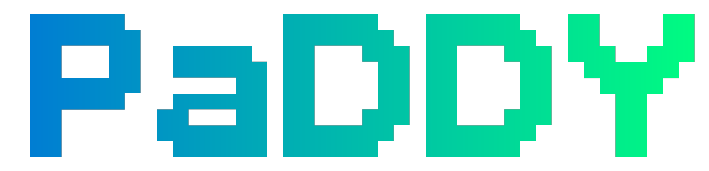
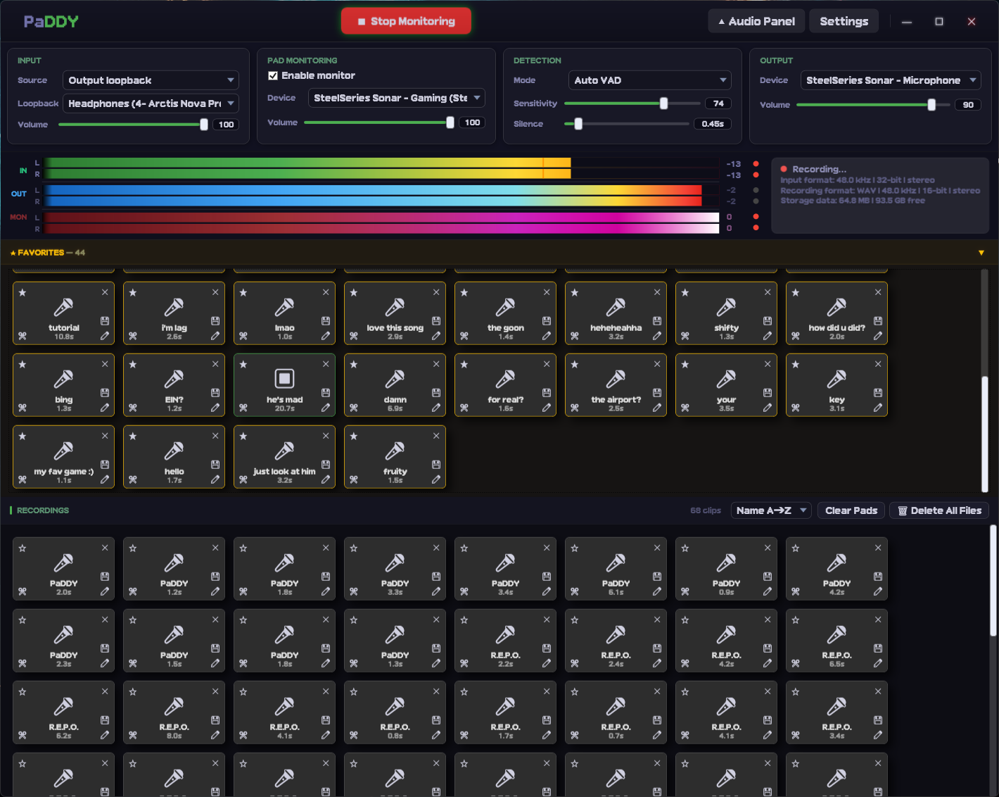
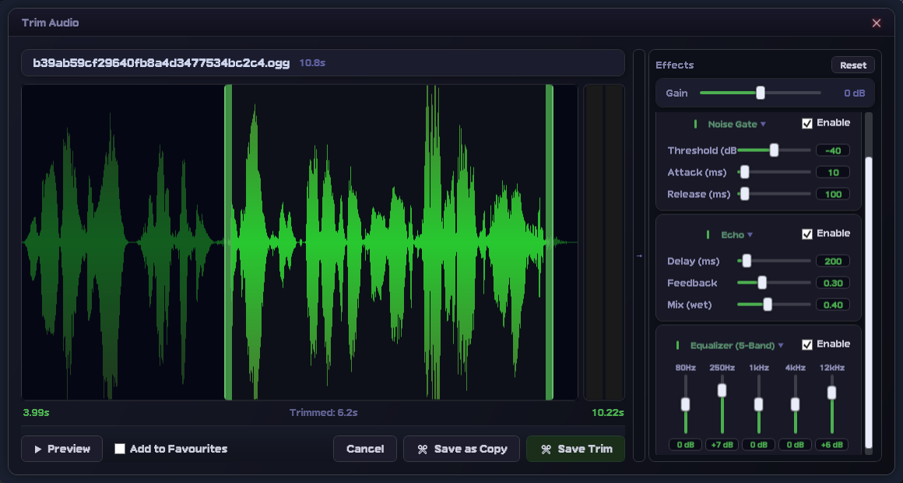

# PaDDY

  

  
  
  
  

  <strong>Fast voice and system-audio capture for Windows, built around a pad-based workflow for recording, organizing, monitoring, trimming, and replaying short clips.</strong>

  🌐 <a href="https://noid1290.github.io/PaDDY/">Official Website</a> • 📦 <a href="https://github.com/NoID1290/PaDDY/releases">Releases</a>

---

## 📖 Table of Contents
- [Overview](#-overview)
- [Core Highlights](#-core-highlights)
- [Deep Feature Breakdown](#-deep-feature-breakdown)
- [Configuration & Placeholders](#-configuration--placeholders)
- [Installation & Requirements](#-installation--requirements)
- [Building From Source](#-building-from-source)
- [Workflow Guide](#-workflow-guide)
- [Screenshots](#-screenshots)
- [License](#-license)

---

## 🔍 Overview

**PaDDY** is a specialized Windows audio recorder engineered for **low-friction capture**. It simultaneously supports standard microphone input, full system loopback, and targeted, app-specific loopback. Captured clips are piped straight into a highly visual, pad-based interface where you can quickly preview, manage, trim, and apply real-time DSP effects—all backed by a lightning-fast SQLite storage layer.

---

## ✨ Core Highlights

| Feature | Capabilities |
| :--- | :--- |
| **Dual Capture Modes** | **AutoVAD** (Voice Activity Detection) or **Key Buffer** (rolling retro-active cache). |
| **Flexible Sources** | Microphone, line-in, entire Windows audio subsystem, or targeted app loopback. |
| **Premium Formats** | Export flawlessly to **WAV**, **MP3**, **Opus**, **Ogg Vorbis**, or **FLAC**. |
| **Pro Level Metering** | Live input, playback output, and independent monitor RMS meters with peak indicators. |
| **SQLite Management** | Persistent, robust recording catalog tracking favorites, clip states, and metadata. |

---

## 🛠️ Deep Feature Breakdown

### 🎙️ Advanced Capture Engines

*   **AutoVAD Mode:** Monitors incoming audio signals dynamically, instantly cutting clips when active speech begins and cleanly stopping them when silence thresholds are met. Perfect for hands-free workflow capture.
*   **Key Buffer Mode:** Keeps a continuous, low-overhead rolling audio buffer running silently in the background. Smash your global hotkey to pull and save the last N seconds of audio out of the past instantly.

### 🎛️ Destructive Trim & FX Engine
The built-in Waveform Trim Editor gives you surgical control over your raw samples before or after saving:
*   **Waveform Visualization:** Precise drag-and-drop handles for instant trimming.
*   **Live Preview Processing:** Audition your trims seamlessly via designated audio endpoints.
*   **Integrated DSP Effects:** 
    *   Dynamic Pre/Post Gain staging.
    *   Customizable Fade-In & Fade-Out curves.
    *   Adjustable Noise Gate and Echo parameters.
    *   Dedicated 5-band hardware-style EQ fixed at 80Hz, 250Hz, 1kHz, 4kHz, and 12kHz.

---

## ⚙️ Configuration & Placeholders

Tailor your environment with highly granular control panels built directly into the UI:

*   **Auto-Cleanup Rules:** Set maximum historical recording caps to auto-purge stale files while safely exempting your Favorites.
*   **Dynamic Custom Naming:** Generate intelligent filename patterns on the fly. 

    💡 Template Examples:
    {timestamp}_{app}_{codec}.wav  ->  20260713-1152_Discord_Opus.wav

### Supported String Identifiers:
*   `{timestamp}` – Exact localized system date and time stamp.
*   `{codec}` – Current recording format profile.
*   `{app}` – Dynamically identifies and maps the name of the focused application.

---

## 💾 Installation & Requirements

### System Requirements
*   **OS:** Windows 10 / Windows 11 (x64 Environment)
*   **Dependencies:** Pre-packaged self-contained runtime included in release builds.

### Quick Start
1. Move over to the Releases portal.
2. Grab the latest `PaDDY_[version].zip` distribution.
3. Extract the contents cleanly to your target directory.
4. Fire up `PaDDY.exe` to get started.

---

## 💻 Building From Source

For developers looking to extend the audio engine or customize pipeline wrappers.

### Prerequisites
*   Windows 10 / 11 SDK environment
*   **.NET 10 SDK** compiler framework

### Build Pipeline Execution
Open up a PowerShell instance inside the project root and run:

    # Restore dependencies and solution structures
    dotnet restore PaDDY.sln

    # Compile optimized runtime binaries
    dotnet build PaDDY.csproj --configuration Release

### Technical Specs
*   **Framework Architecture:** `net10.0-windows`
*   **UI System:** Windows Presentation Foundation (WPF)
*   **Compilation Target:** `win-x64` (Fully Self-Contained Deployment)
*   **Storage Layer:** Local SQLite DB wrapper

---

## 🕹️ Workflow Guide

1. **Select Input Target:** Choose between Mic/Line, System Loopback, or Target Application.
2. **Engage Capture Strategy:** Choose AutoVAD for vocal automation, or Key Buffer to capture recent action retrospectively.
3. **Route & Adjust:** Fine-tune your recording thresholds, default audio profiles, and monitoring meters.
4. **Manage via Pads:** Click, trigger, sort, and tag your captures immediately on the pad interface.
5. **Polishing:** Use the trim interface and the 5-band EQ stack to polish and export your clips.

---

## 📸 Screenshots

### Main Workspace Dashboard

### Waveform Visual Trim Editor

---

## 📄 License

Distributed under the **MIT License**. Check out LICENSE for full details.

  <strong>NoID Softwork, Vincent Leclair © 2020 - 2026</strong>

